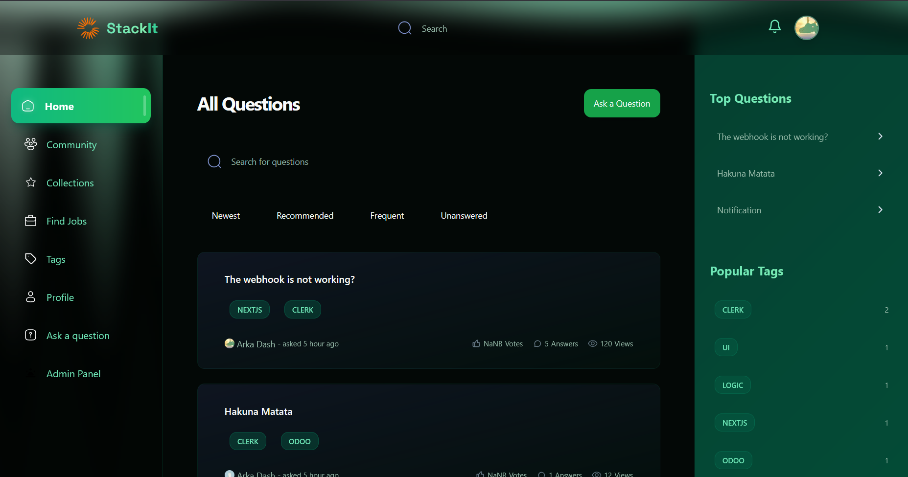

Team Name: Team 3757


# ✨ StackIt: The Modern Q&A Platform for Developers

<p align="center">
  
</p>

<p align="center">
  <strong>A cutting-edge, feature-rich Q&A platform built with Next.js, Tailwind CSS, Clerk, and MongoDB.</strong>
</p>

---

## 🚀 What is StackIt?

**StackIt** is a sophisticated platform designed for developers to collaborate, share knowledge, and solve complex problems. It offers a seamless experience for asking questions, providing answers, and engaging with a community of peers. With a stunning UI, real-time notifications, and a dedicated admin panel, StackIt is the ultimate tool for developers.

---




Demo Video Link: https://youtu.be/eTWKgCwmYD0


## 🌟 Key Features

### 🎨 **Stunning UI & UX**
- **Unified Dark Theme**: A consistent and beautiful dark theme is enforced across the entire application for a premium user experience.
- **Glass Morphism & Blur Effects**: The UI features modern glass morphism effects with blurred backgrounds, creating a sleek and professional look.
- **Aurora Backgrounds**: Dynamic, animated Aurora backgrounds are integrated into the navigation components for a visually stunning effect.
- **Micro-Animations**: Smooth animations and transitions are used throughout the application to enhance the user experience and provide delightful feedback.

### 🔔 **Real-Time Notification System**
- **Instant Alerts**: Users receive real-time notifications for new answers on their questions and replies to their comments.
- **Unread Count**: The navigation bar displays a real-time count of unread notifications, ensuring users never miss an update.
- **Notification Center**: A dedicated dropdown menu allows users to view, manage, and mark notifications as read.

### 🔍 **Advanced Search & Navigation**
- **Expanding Search Bar**: The global search bar features a beautiful animation, expanding smoothly when focused and providing a seamless search experience.
- **Animated Sidebars**: Both the main and admin sidebars are enhanced with hover animations, shimmer effects, and gradient backgrounds for a modern look.
- **Intuitive Navigation**: The navigation has been refactored to be more intuitive, with clear and accessible links to all major sections of the application.

### 🔒 **Robust Admin Panel**
- **Dedicated Interface**: The admin panel now features a unique, professional UI with a lighter color scheme to distinguish it from the main site.
- **Separate Layout**: The admin section has its own dedicated layout, including a unique navbar and sidebar, for a clean and organized experience.
- **Comprehensive Management**: Admins can manage users, answers, and other platform-related activities through a centralized and intuitive interface.

<details><summary><b>🗂️ Folder Structure</b></summary>

The project is organized with a clear and scalable folder structure, separating concerns and making it easy to navigate and maintain the codebase.

</details>

## 🛠️ Technologies Used

<details><summary><b>StackIt</b> is built with a modern and powerful tech stack:</summary>

- **TypeScript**: Typed superset of JavaScript for robust and scalable code.
- **Next.js**: React framework for building server-rendered and statically generated web applications.
- **Tailwind CSS**: Utility-first CSS framework for rapidly building custom user interfaces.
- **Clerk**: Developer-first authentication and user management.
- **Shadcn-UI**: Beautifully designed and accessible UI components.
- **MongoDB & Mongoose**: Flexible and powerful database solution for modern applications.
- **Prism.js**: Lightweight and extensible syntax highlighter for code snippets.
- **And more...**

</details><br/>

[](https://skillicons.dev)

## 🚀 Get Started

Follow these instructions to get the project up and running on your local machine.

### 📋 Prerequisites

- [Node.js](https://nodejs.org/en/)
- [NPM](https://www.npmjs.com/get-npm)
- [Git](https://git-scm.com/downloads)

### ⚙️ Installation & Setup

1.  **Clone the Repository**:
    ```bash
    git clone https://github.com/NevroHelios/StackIt.git
    ```
2.  **Install Dependencies**:
    ```bash
    npm install
    ```
3.  **Set Up Environment Variables**:
    Create a `.env` file in the root directory and add the required API keys and credentials for services like Clerk, MongoDB, and others.

4.  **Run the Development Server**:
    ```bash
    npm run dev
    ```
5.  **View the Application**:
    Open [http://localhost:3000](http://localhost:3000) in your browser to see the result.

---

## 🙏 Acknowledgements

A special thanks to the teams and communities behind the amazing open-source projects that made **StackIt** possible. Your contributions are invaluable and greatly appreciated.
